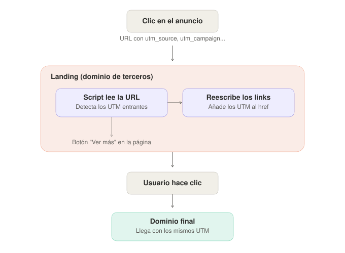

# UTM Cross-Domain Forwarder

*[Leer en español](README.md)*

Small vanilla JS script (no dependencies) for a specific problem: **your campaign landing lives on a domain that isn't your final domain**, and the links on that landing lose your UTM parameters along the way.

Meant to be injected via GTM (or a direct `<script>` tag) on a third-party landing page.

## The problem

Typical scenario: you run an ad campaign pointing to `agency-landing.com/promo?utm_source=meta&utm_campaign=summer`. That landing has a "Learn more" button linking to `example.com` — your actual domain. If that link is a static `href`, the UTMs the user arrived with get dropped on the jump. Your Analytics on `example.com` sees "direct / none" traffic, and the whole campaign goes unattributed.

## What the script does

1. Reads the UTM parameters present in the landing's current URL.
2. If any are found, it walks through every `<a>` on the page.
3. For links pointing to your final domain (`targetDomain`), it rewrites the `href`, adding (or overwriting) those UTM parameters.

Nothing else. No persistence, no fetch calls, no cookies read or written.

## Design decisions (and why)

**Cookieless by design.** The script only reads `window.location.search` at the moment it runs and rewrites the DOM — it doesn't use `sessionStorage`, `localStorage`, or cookies. As a result, it works exactly the same whether the user accepts or rejects the consent banner, because there's nothing to consent to (no access to device storage under ePrivacy Art. 5.3). The trade-off is explicit: **it only covers a single page**. If the landing has 2-3 pages before the final link, UTMs that only arrived in the page 1 URL won't reach page 2. If you need to cover that case, the fix runs through `sessionStorage` — but then you're in the zone of needing consent if the CMP blocks Web Storage too.

**Domain matching by `hostname`, not substring.** The original version I started from (found circulating online, no clear authorship — if you recognize it, let me know and I'll credit it) compared with `href.indexOf(domain) > -1`. That matches any URL *containing* the domain string anywhere — a query param, a lookalike domain (`evil-example.com`), anything. Here, `url.hostname` is compared exactly.

**Overwrites existing UTMs instead of ignoring them.** The original version only decorated a link if it had *no* UTM parameters at all — if it already had even one, it skipped decoration entirely, despite the code comment saying "add or replace." Here it always uses `.set()`, so the real UTM from the current session always wins.

## How to use it

1. Replace `targetDomain` with your actual domain.
2. Adjust `paramsToForward` if you use custom parameters in addition to (or instead of) the standard `utm_*` ones.
3. Paste the script into the landing — via GTM (Custom HTML tag, "All Pages" or "Page View" trigger) or directly before `</body>`.

## Known limitations

- Covers a single page only. Doesn't work if the user navigates through several pages of the third-party landing before reaching the final link.
- Doesn't decorate links added dynamically after the script runs (e.g., inserted by another async script later). If your landing loads content async, you'll need to re-run the forwarder after that load or use a `MutationObserver`.
- Doesn't touch `<form>` elements or JS redirects (`window.location = ...`) — only `<a>` `href` attributes.

## Origin

The starting point is a UTM decoration script that circulates across various analytics repos and blogs, with no clear authorship. I reviewed it, found a couple of bugs (explained above), and adapted it to a specific use case (third-party landing, cookieless). Sharing it as-is — it probably doesn't cover your exact case, but it might save you the starting point. Take it, improve it, or discard it.

## License

MIT. Use it without asking.
